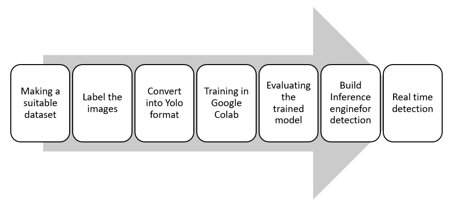
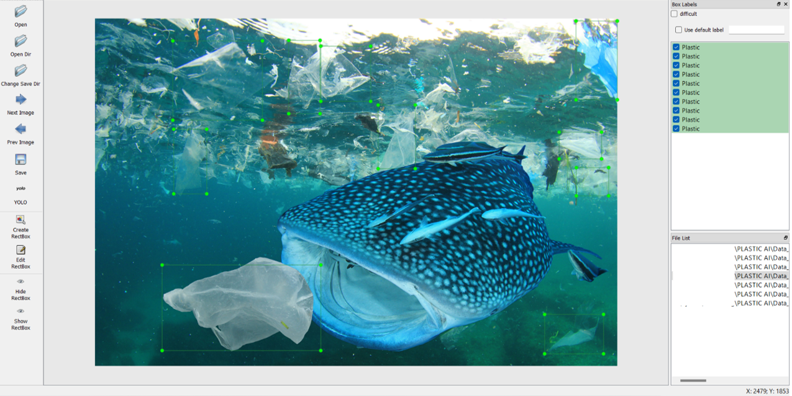
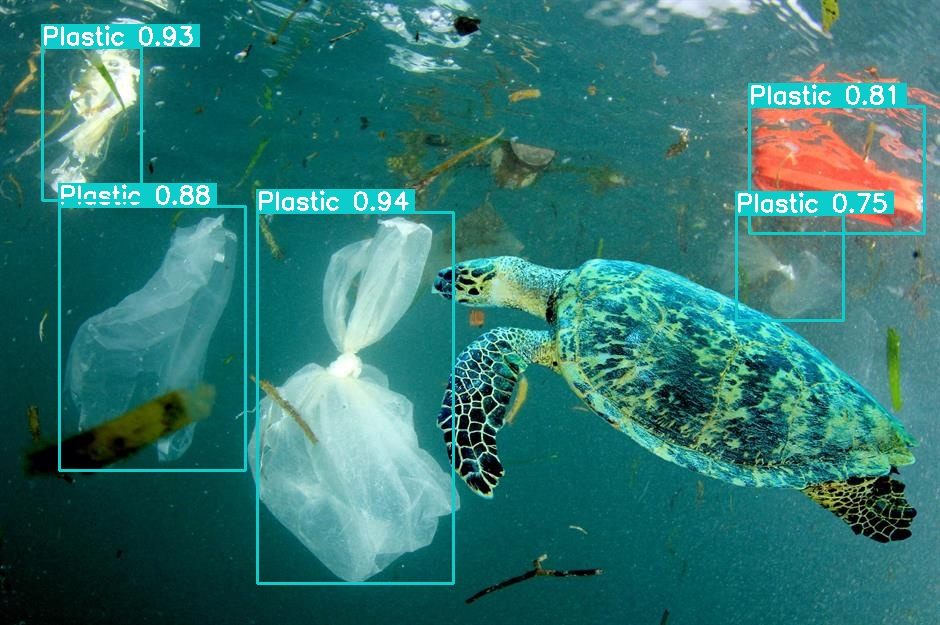
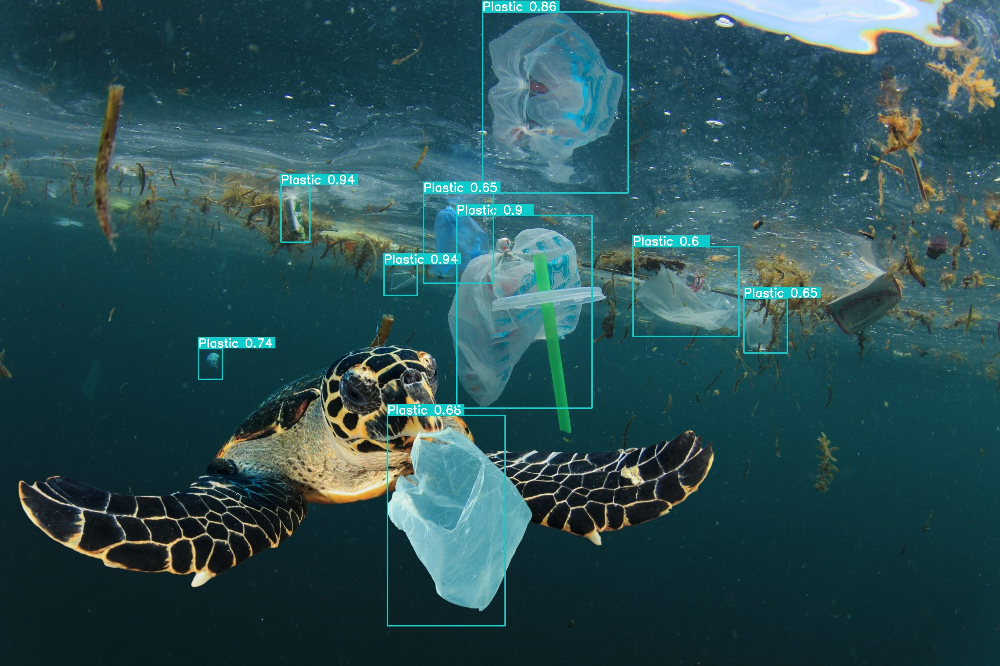
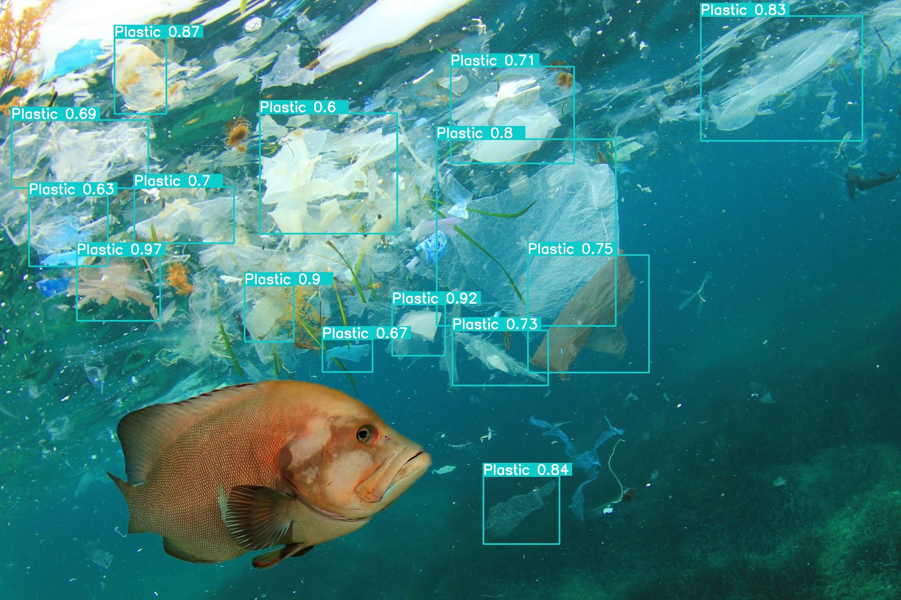
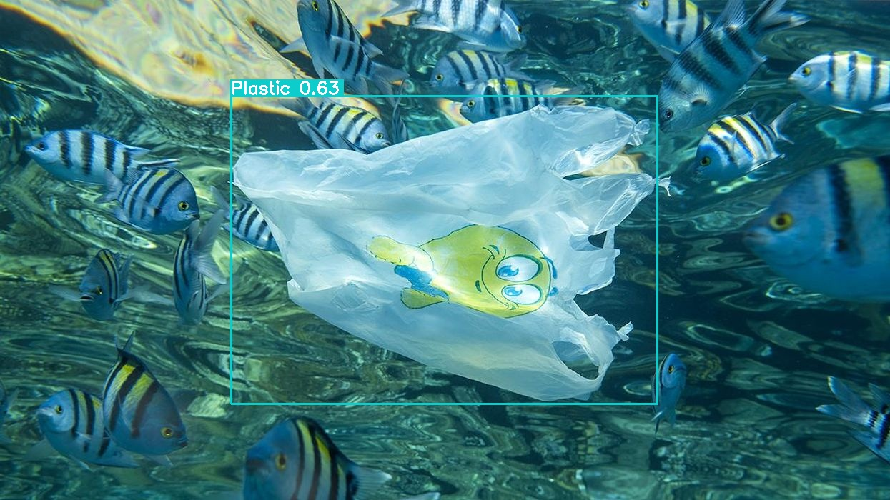
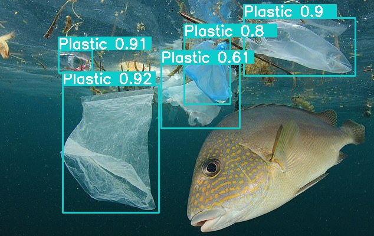
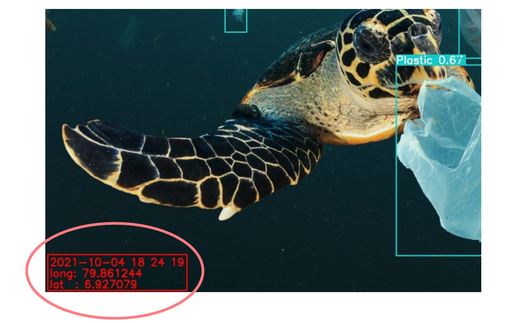
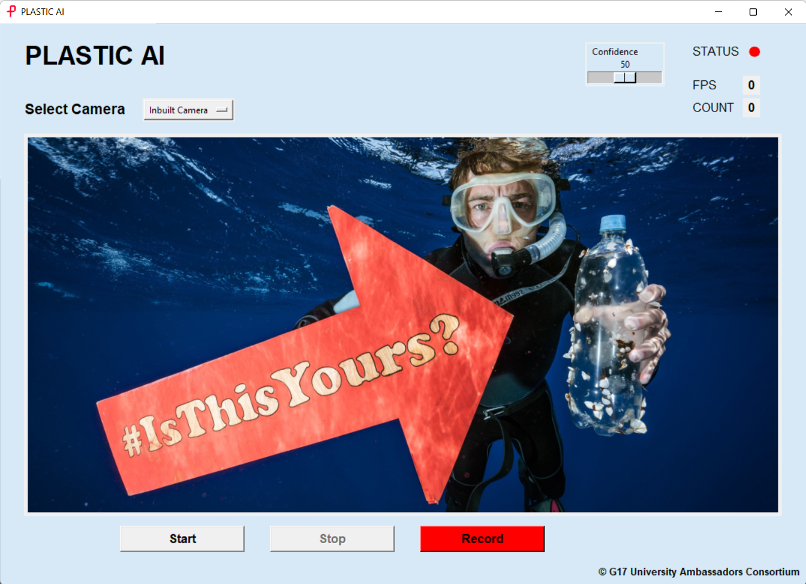
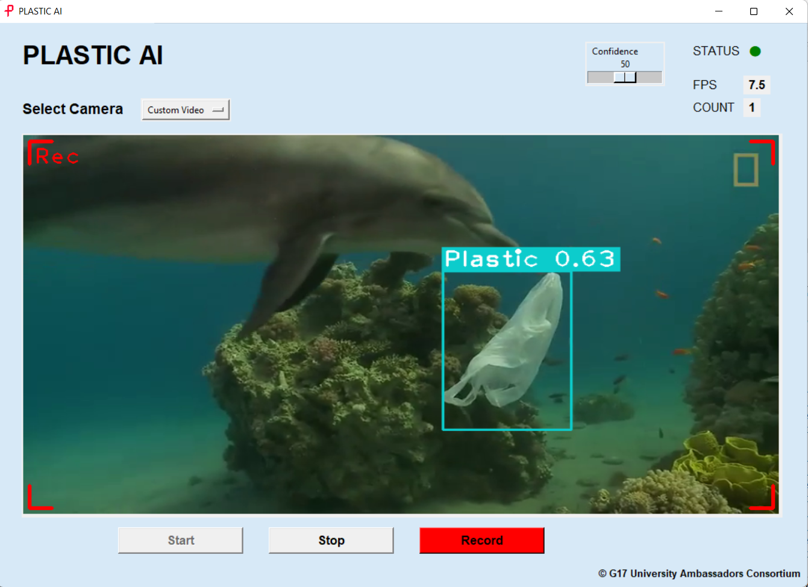

# **PLASTIC AI – SAVING THE MARINE LIFE WITH DEEP LEARNING**

**AN AUTOMATED WORKFLOW TO QUANTIFY AND MONITOR MARINE PLASTIC AROUND THE WORLD**

OVERVIEW

Over 300 million tons of plastic are produced every year and more than 60 precent of them are designed to single use applications such as shopping bags, plastic cups, spoons, and straws. At least 8 million tons of them ends up in the ocean every year. By 2050, the total amount of plastic trash in the sea will outweigh all the ocean fish. In an effort to join the battle against ocean, I have developed an open source deep learning based object detection project called **PLASTIC AI**. The project is aligned with the United Nation&#39;s sustainable development goal 14, Life below water.

The project is mainly based on the yoloV3 and yoloV4 object detection frameworks and provide a graphical user interface for everyone to get the maximum usage of this well-trained models. Not only that this provides the freedom for developers to customize and built new applications and models on top of this trained model.

APPLICATIONS

- Customizable for any type of operations related to ocean protection
- Trained model can be to work real time on underwater surveillance systems, manned and unmanned surface vessels and all the types of detection cameras.
- Implementable on satellites for real time maritime observations

SCOPE

Develop a machine learning model to classify and detect maritime plastic trash accurately from a live camera feed.

PROCESS

DATASET

Already labeled dataset   
[https://drive.google.com/file/d/1JQ33jmM3kdeF5cRgQ39ceCnP\_fXIO9d/view?usp=sharing](https://drive.google.com/file/d/1JQ33jmM3kdeF5cRgQ39ceCnP_fXIO9d/view?usp=sharing)

with self-annotated images with Labellmg

TRAINING THE MODEL

Convert the data into YOLO format by using a python script and then move into the training stage which is very resource intensive. Therefore, training the model is done in a powerful computer provided by google and the processes took more than 12 hours for train a single yolo model.

Link to  downloadtrained weight  files   
[https://drive.google.com/drive/folders/10BhAuhWVaDb66S9oe95BawKlUkw1EVik?usp=sharing](https://drive.google.com/drive/folders/10BhAuhWVaDb66S9oe95BawKlUkw1EVik?usp=sharing)

INFERRED IMAGES

DDETECTION WITH TIMESTAMP + LOCATION DATA

THE GUI FOR GENERAL APPLICATION

**Pasindu Ranasinghe** 
G17 University Ambassador | University of Moratuwa 
GOAL 14 | Life Below Water 
G17 University Ambassadors Consortium | The Road to Rights

